|  [Home](README.md)  |  [Confirmed Cases](confirmed_cases.md)  |  [Recovered Cases](recovered_cases.md)  |  [Deaths](death_cases.md)  |  [Daily Cases](daily_cases.md)  |  [CSV Page](csv_page.md)  |
## Welcome to the Covid19-Assignment
### By S.I.D. 1836811

---
SITE IS NOW BASED ON A DEPRECIATED DATA STRUCTURE. FOR MORE INFORMATION PLEASE CHECK 
[THIS LINK](https://github.com/CSSEGISandData/COVID-19/tree/master/csse_covid_19_data/csse_covid_19_time_series).
---

All graphs will contain the value of the final data point in order to make them more understandable.
The currently more important regions will be previewed here.

There will be both linear and logarithmic graphs show for each data set.
The logarithmic graphs remove the inherent bias of the linear graph to large values. 
e.g losing the detail found in smaller values. The graphs for Africa Confirmed Cases are the perfect example.

#### Interactive Graphs
Selecting the countries in the legend will show/hide their data.

[Global - Confirmed Cases](graphics/interactive_plot_for_confirmed.html)      

[Global - Recovered Cases](graphics/interactive_plot_for_recovered.html)      

[Global - Deaths](graphics/interactive_plot_for_deaths.html)

#### The UK
**Confirmed Cases**

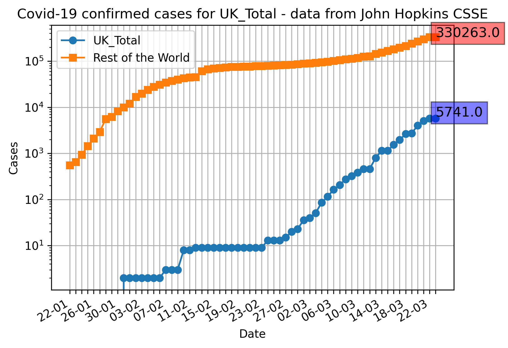

**Cases in which patients have recovered**

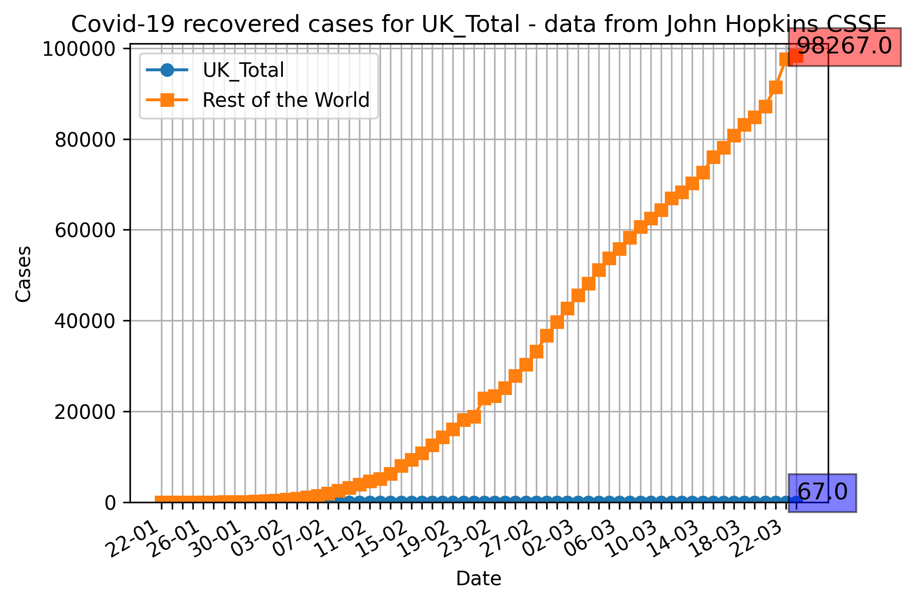
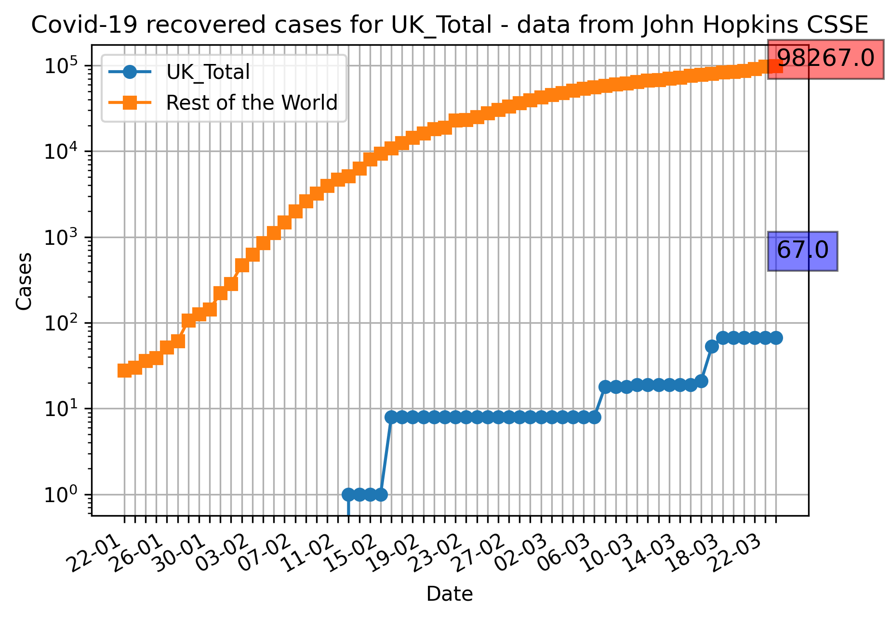

**Cases which have led to death**

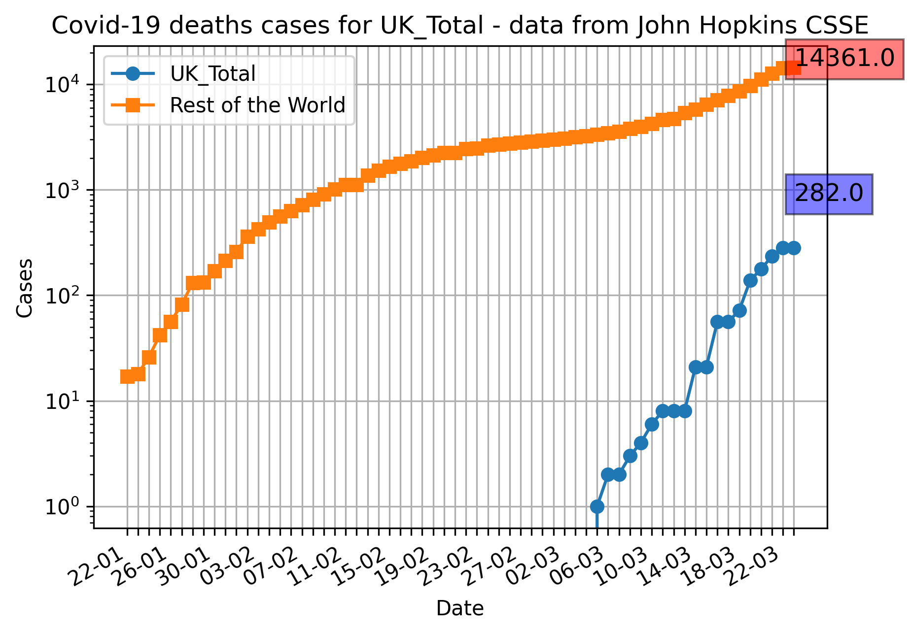

#### Italy
**Confirmed Cases**

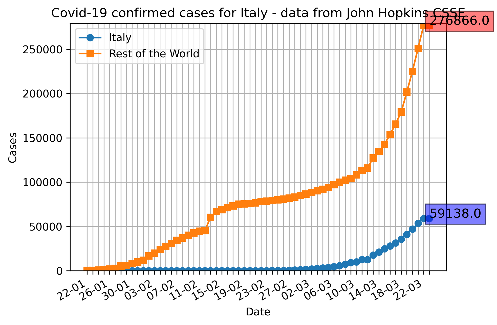
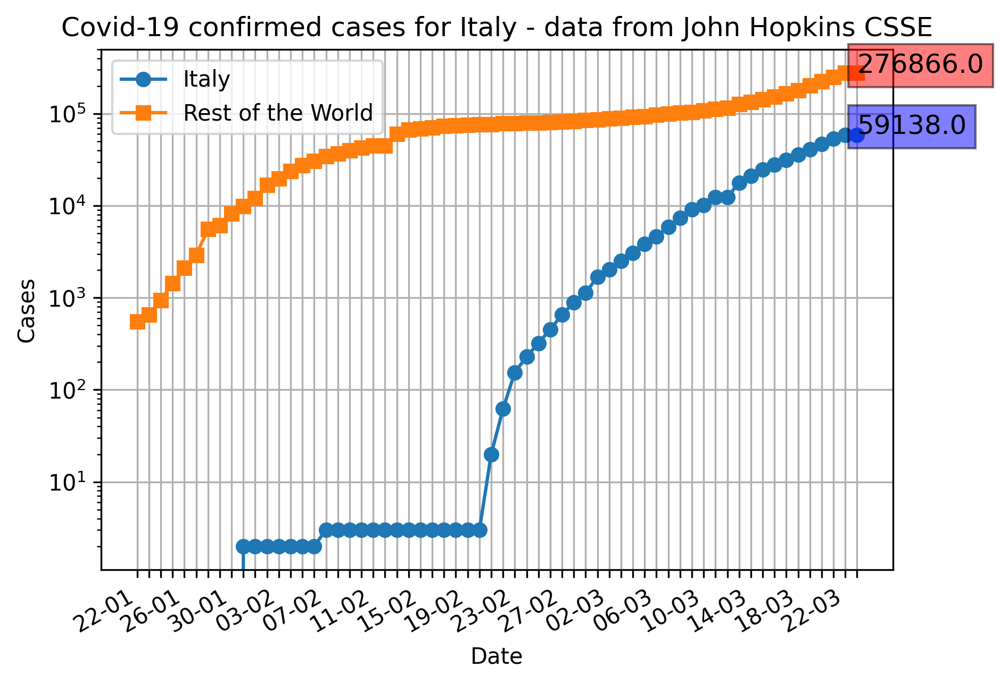

**Cases in which patients have recovered**

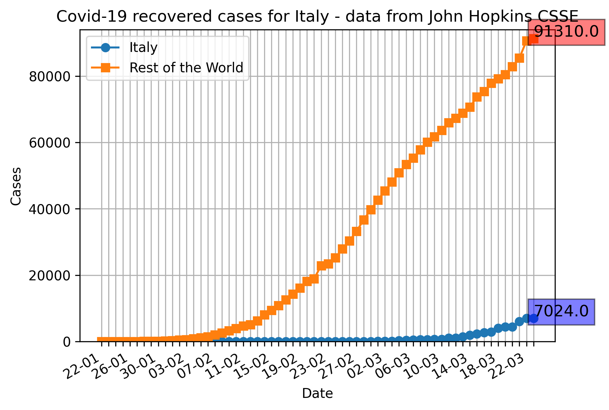

**Cases which have led to death**

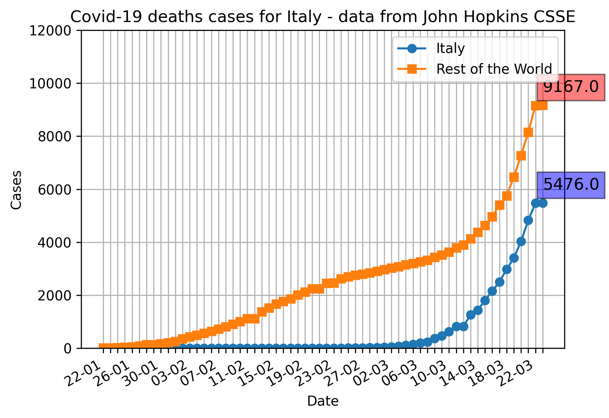
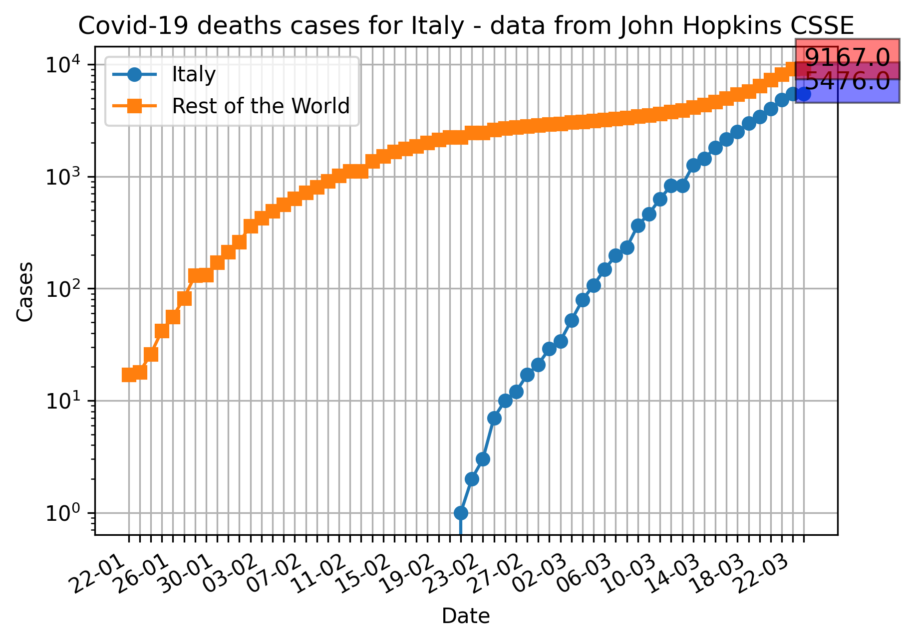

#### Mainland China
**Confirmed Cases**

**Cases in which patients have recovered**

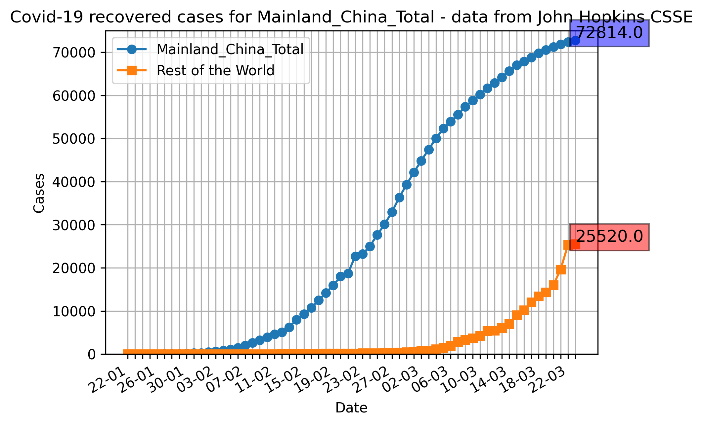
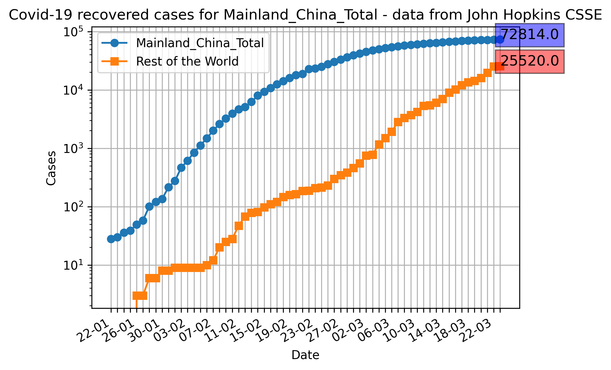

**Cases which have led to death**

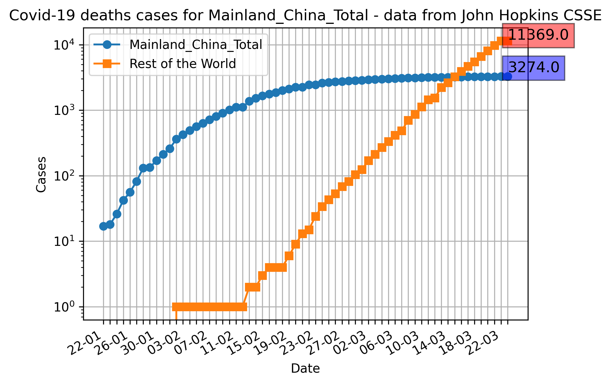

Covid-19 is a coronavirus that has recently made the news due to its sudden spread across the world. Mainly causing
 flu-like symptoms there is the possibility of pneumonia in rare circumstances.

One study, considered the largest of its kind on Covid-19, from the Chinese Center for Disease Control and Protection
 analysed over 44,000 confirmed cases in China. Of those cases, 80.9% (or 36,160 cases) were considered mild, 13.8% 
 (6,168 cases) severe and 4.7% (2,087) critical.

Critical cases being those that resulted in respiratory failure, septic shock and/or multiple organ dysfunction/failure.
 To read more the paper is found [here](http://weekly.chinacdc.cn/en/article/id/e53946e2-c6c4-41e9-9a9b-fea8db1a8f51).

So far there have been very few cases of death in those below 40 with death rates below 0.2 and no fatalities od those
 under 10. It is thought that those under 10 are experiencing a milder version of the disease for an unknown reason.
Yale School of Medicine have released this [blog](https://medicine.yale.edu/news-article/22996/) article on helping
 stop the spread to and between children.
The CDC have also released [Q&A's](https://www.cdc.gov/coronavirus/2019-ncov/specific-groups/index.html) covering
 Covid-19 and various populations at risk.

### Support or Contact
This page is being supported by S.I.D. 1836811 and being used as evidence for the Anglia Ruskin University
Apprenticeship programme - BSc Bioinformatics (Data Science) in association with The Sanger Institute.

If you find an issue with this page then please leave an issue on: https://github.com/DLBPointon/dlbpointon.github.io/issues
