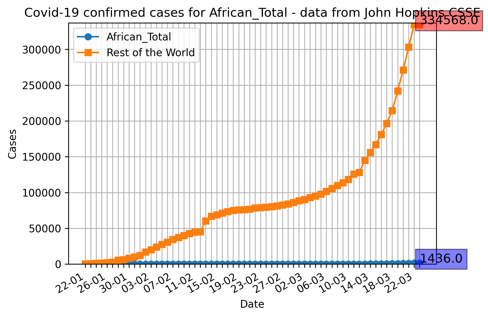
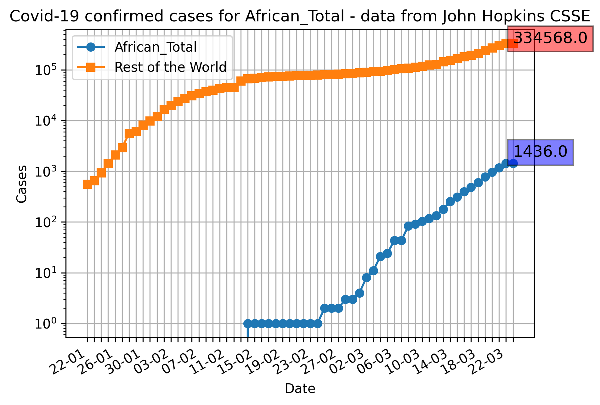
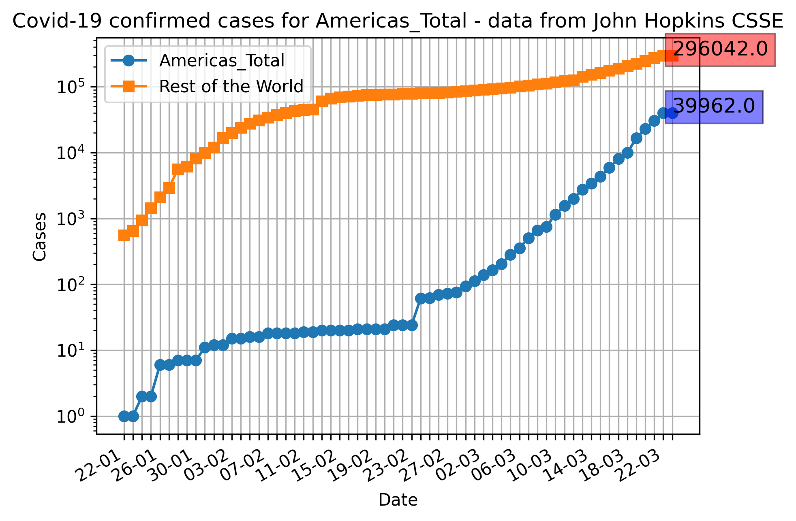
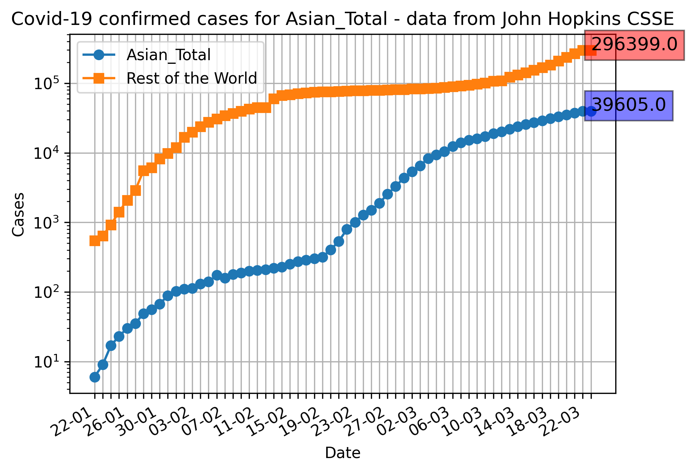
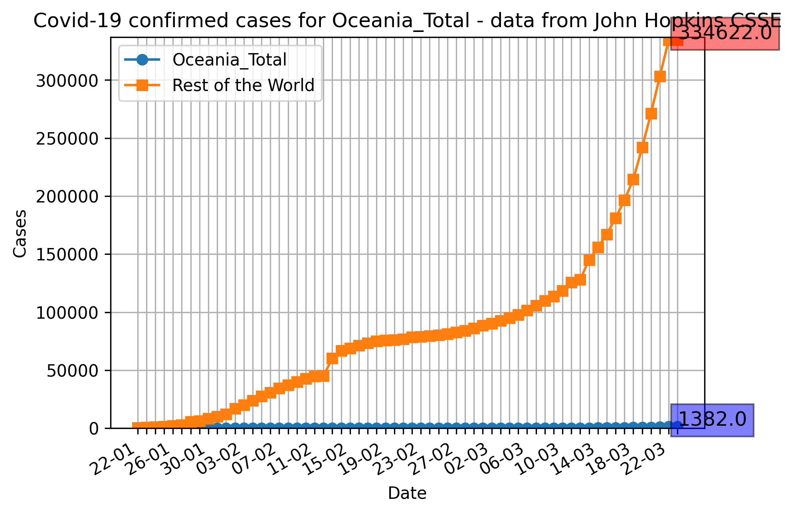
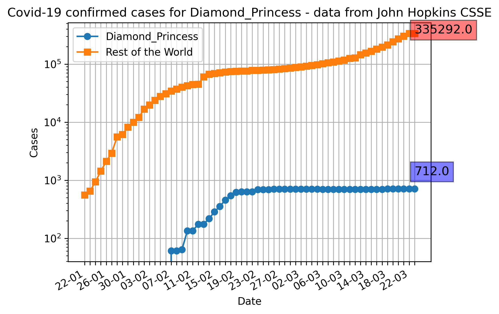
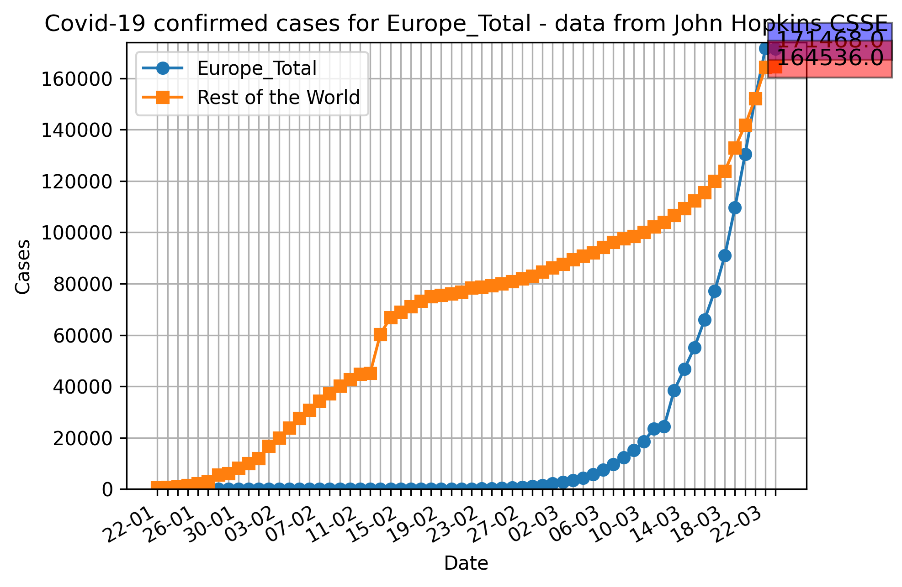
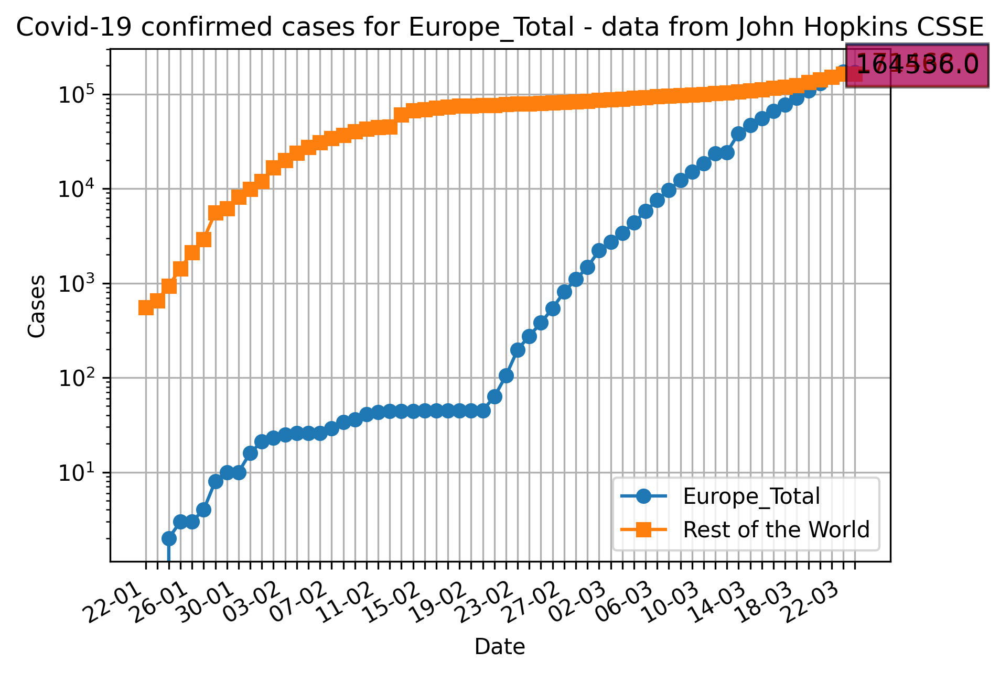
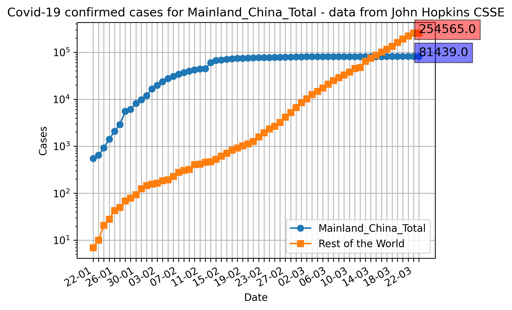

|  [Home](README.md)  |  [Confirmed Cases](confirmed_cases.md)  |  [Recovered Cases](recovered_cases.md)  |  [Deaths](death_cases.md)  |  [Daily Cases](daily_cases.md)  |
# Graphs for Confirmed Cases of Covid-19
The below graphs show the Confirmed Covid-19 cases for each major geographical region compared to the world.

#### Total cases for Africa

#### Total cases for the Americas

#### Total cases for Asia (excluding the Diamond Princess and Mainland China)

#### Total cases for Australia

#### Total cases for the Diamond Princess Cruise Ship

#### Total cases for Europe

#### Total cases for Mainland Chinal

#### Total cases for the UK

#### Total cases for Italy

