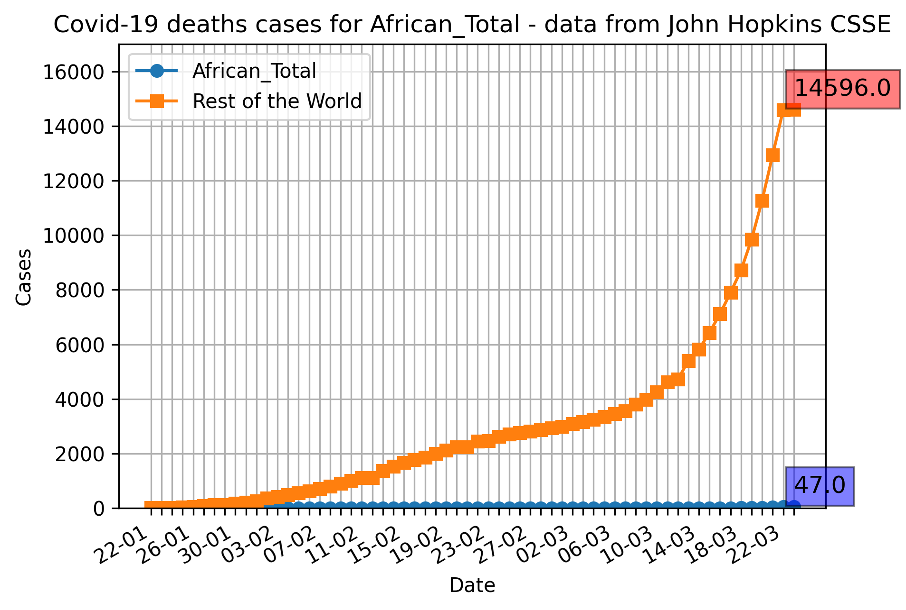
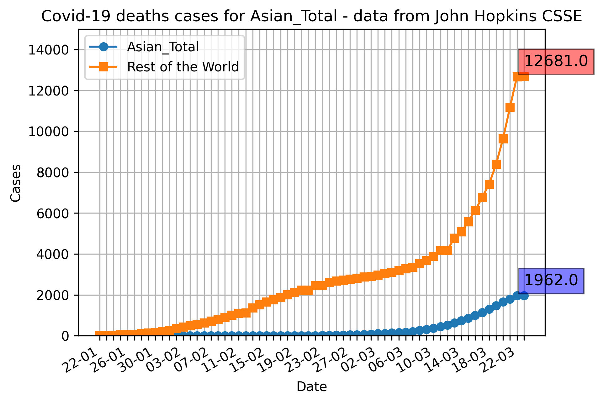
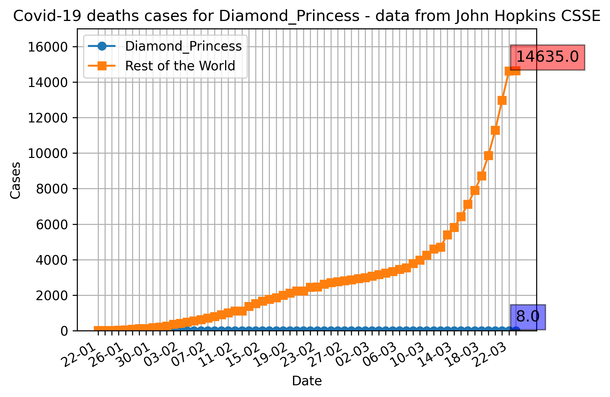
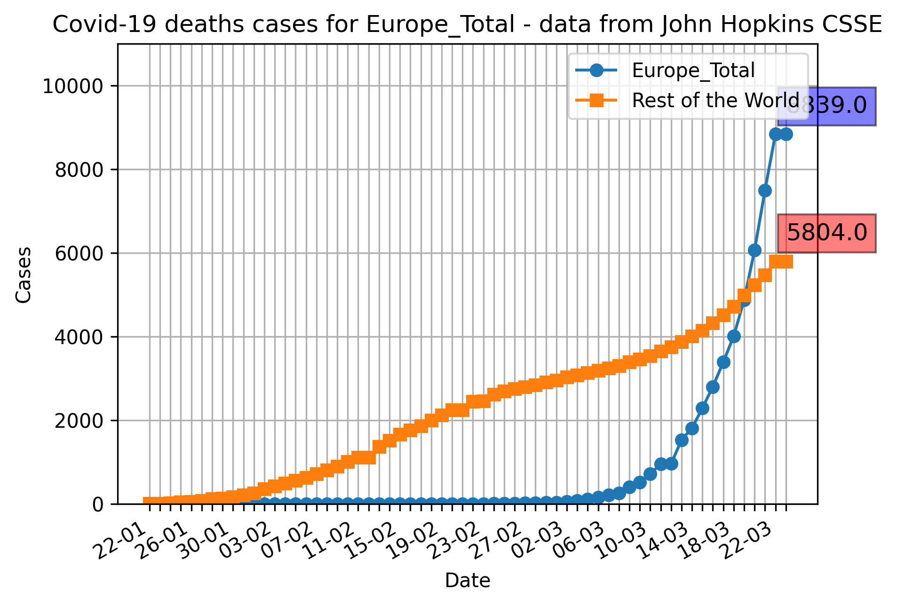

|  [Confirmed Cases](confirmed_cases.md)  |  [Recovered Cases](recovered_cases.md)  |  [Deaths](death_cases.md)  |  [Daily Cases](daily_cases.md)  |  [Home](README.md)  |
## Graphs for the number of Deaths caused by Covid-19

The below graphs show the deaths casued by Covid-19 for each major geographical region compared to the world.

#### Total Death count of Africa

#### Total Death count for the Americas

#### Total Death count for Asia (excluding the Diamond Princess and Mainland China)

#### Total Death count for Australia

#### Total Death count for the Diamond Princess

#### Total Death count for Europe

#### Total Death count for Mainland China

#### Total cases for the UK

#### Total cases for Italy

